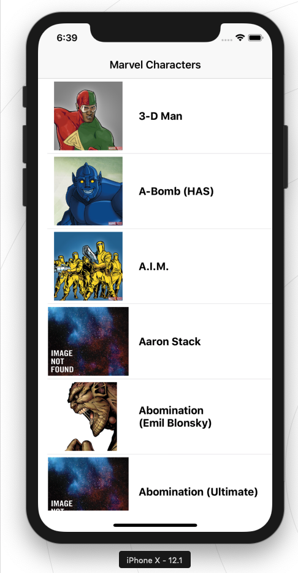
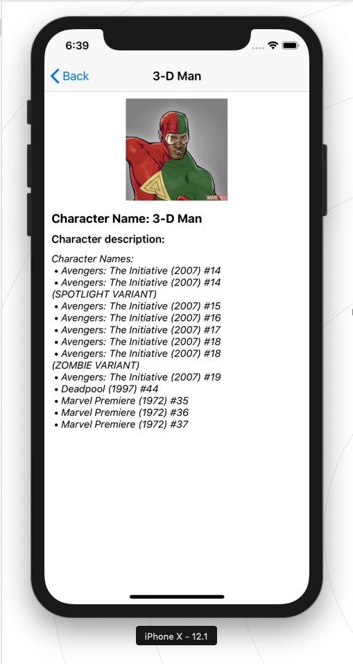
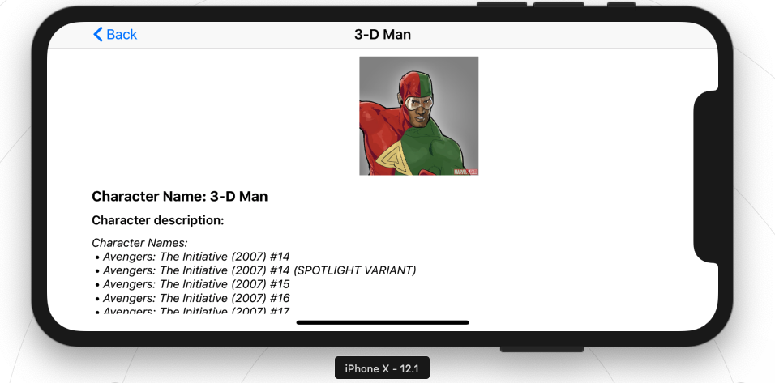
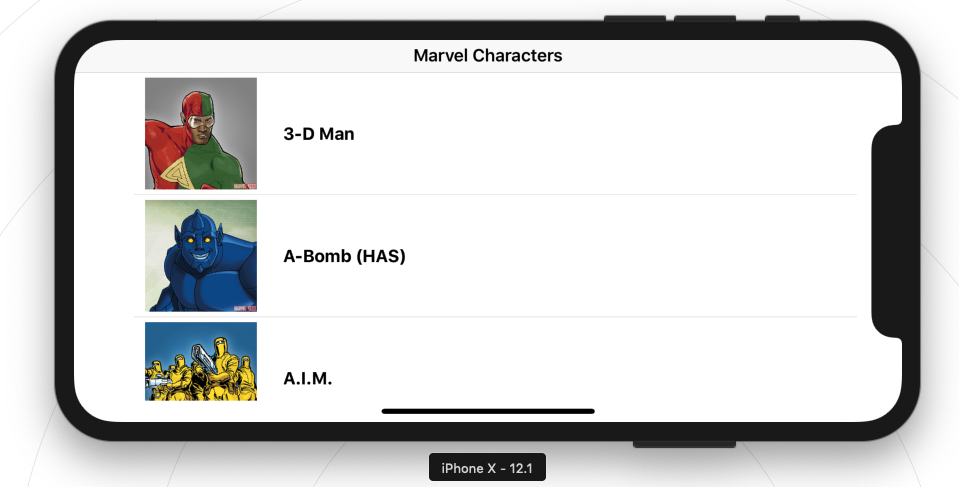

# Marvel

   

## About

Contains Marvel Hero List & detail page. Supported both landscape & portrait.

- The iOS app is built using **Clean Swift MVVM** architecture and it has zero dependencies. It's written purely in Swift.

### Screenshots

</img> </img>
